# Pingu 007

Pingu 007 é um jogo de ação 2D desenvolvido em Java como trabalho da disciplina de Programação Orientada a Objetos.

O jogo foi inspirado no episódio de pesadelo da série **Pingu**. Nele, o jogador controla um Pingu agente secreto que precisa atravessar uma base polar, enfrentar inimigos e derrotar a Morsa para concluir a missão.

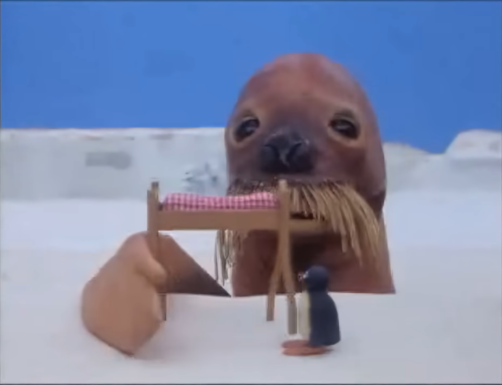

*Episódio de inspiração para o jogo*

## Menu principal

Ao iniciar o jogo, o menu principal permite começar a jogar, acessar as configurações ou encerrar o programa.

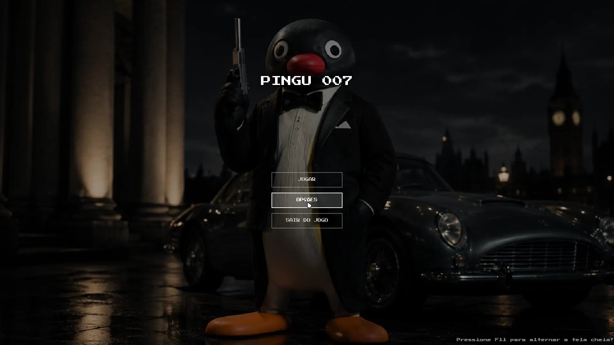

## Gameplay

O personagem pode se movimentar usando `W`, `A`, `S` e `D`, realizar um dash com `Espaço`, atirar utilizando o botão esquerdo do mouse, recarregar a arma com `R` e interagir com objetos pressionando `E`.

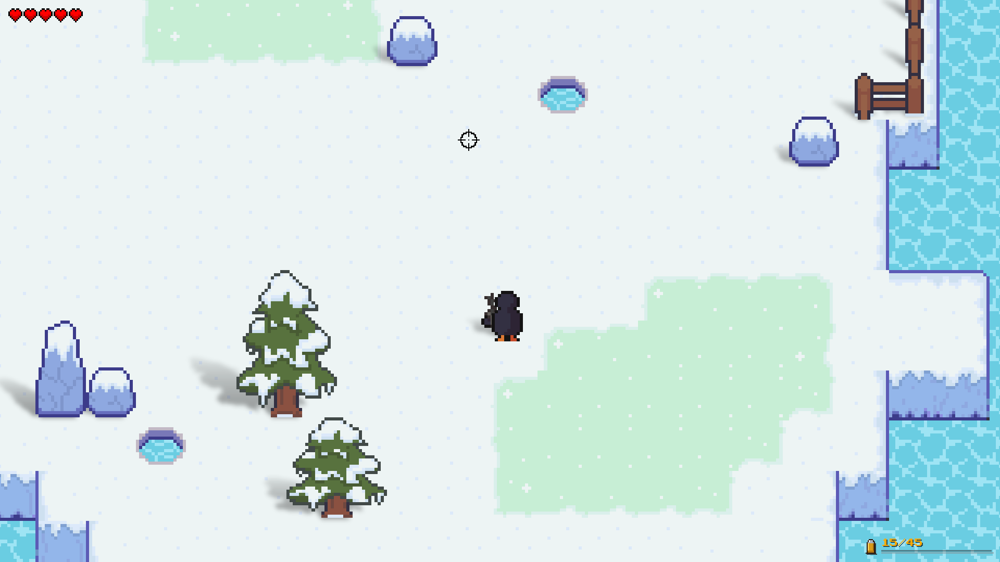

Durante a fase é possível encontrar alguns itens que auxiliam o jogador, como munição, kits de cura e chaves utilizadas para abrir o acesso à sala do chefe.

## Arenas

O mapa também possui algumas arenas. Ao entrar em uma delas, a saída é bloqueada e só é liberada após todos os inimigos serem derrotados.

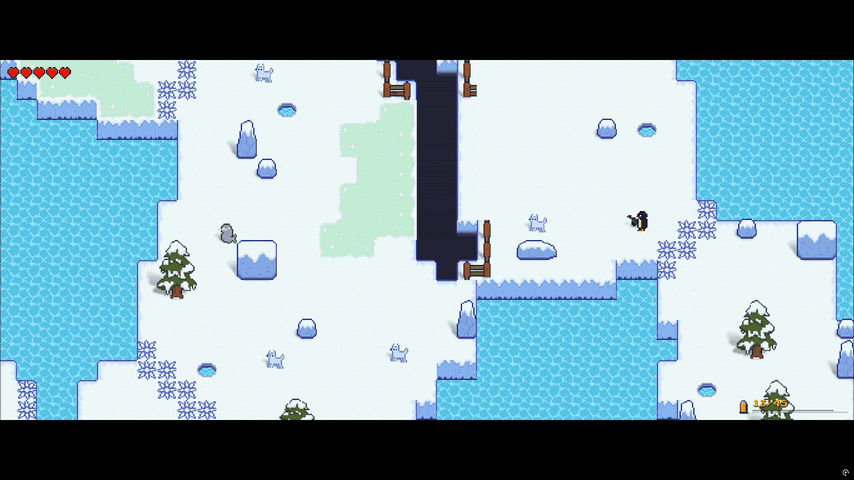

## Pesca

Depois de ganhar do pescador a **vara de pesca**, é possível pescar nos buracos de água para conseguir cura de vida, munição, ou chaves para abrir o portão do Boss.

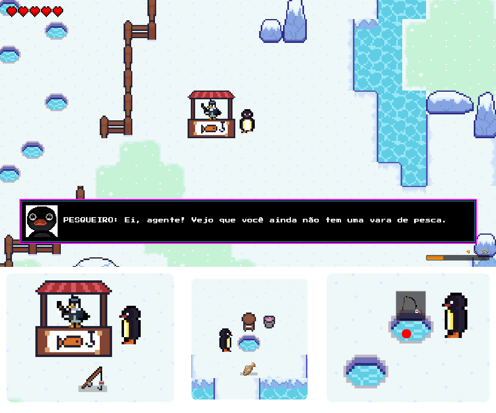

## Inimigos

O jogo possui diversos tipos de inimigos:

* Lobo
* Narval(dasher)
* Boneco de Neve
* Bombardeiro
* Atirador

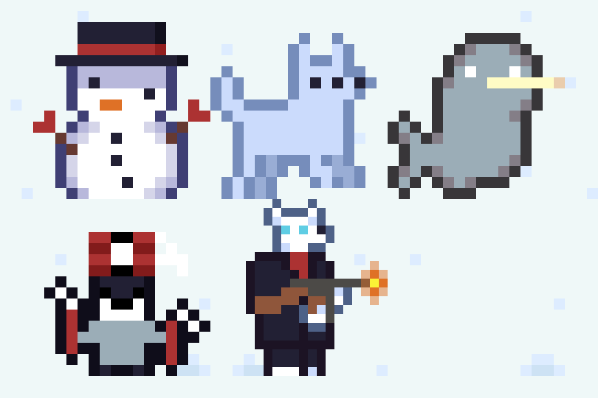

## *NPCs*

Além de inimigos, o jogo possui diversos *NPCs* com os quais o jogador pode interagir para comprar itens, descobrir segredos e receber recompensas.

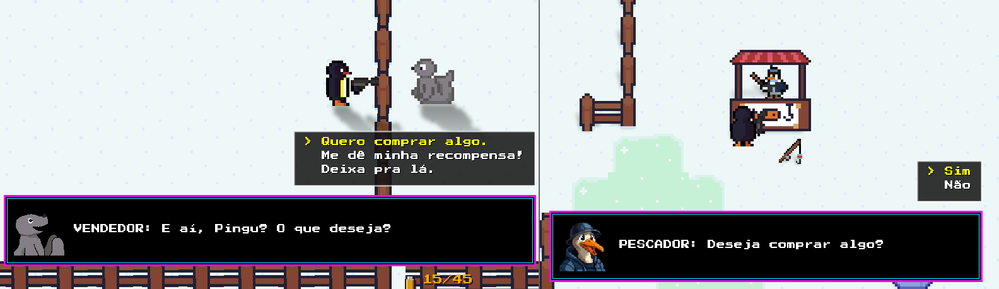

Cada inimigo possui um comportamento diferente, exigindo estratégias distintas durante a fase.


Ao final do mapa acontece a batalha contra a Morsa.

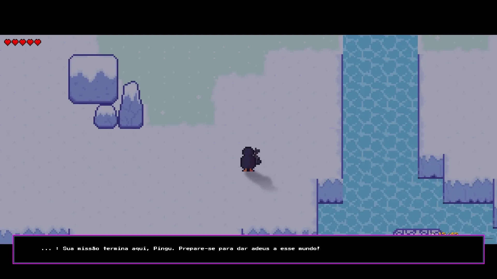


<!--  -->

## Cenário

O mapa é composto por diferentes tipos de terreno. Além da neve comum, existem áreas de gelo que alteram a movimentação do personagem e buracos que causam dano caso o jogador passe sobre eles.

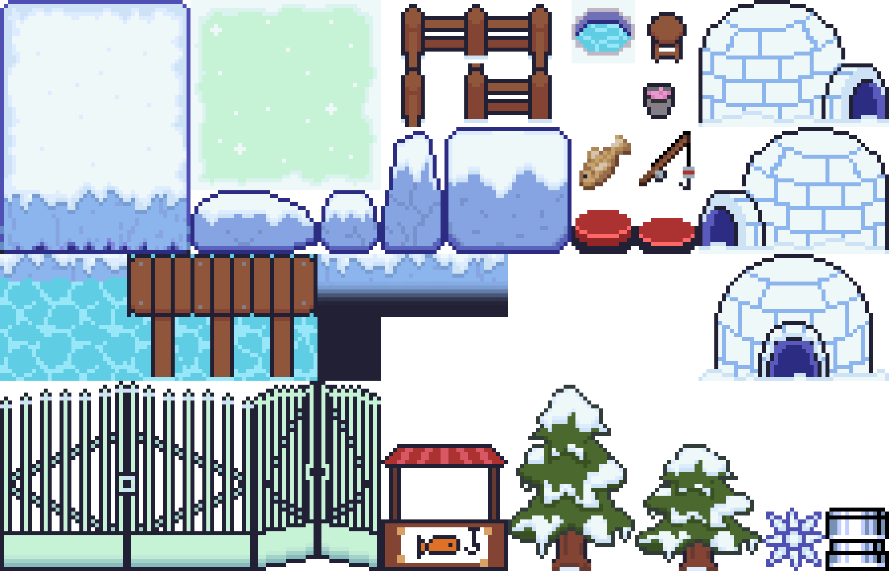


## Configurações

O menu de configurações pode ser acessado tanto pelo menu principal quanto durante o jogo.

Nele é possível ajustar o volume da música e dos efeitos sonoros, além de consultar as teclas de ações do jogo e alternar o modo Tela Cheia.

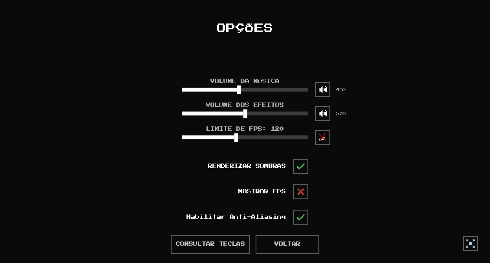

## Pausa

Durante o jogo, pressionando `Esc`, o jogo é pausado. Nesse menu é possível continuar o jogo, abrir as configurações ou retornar ao menu principal.

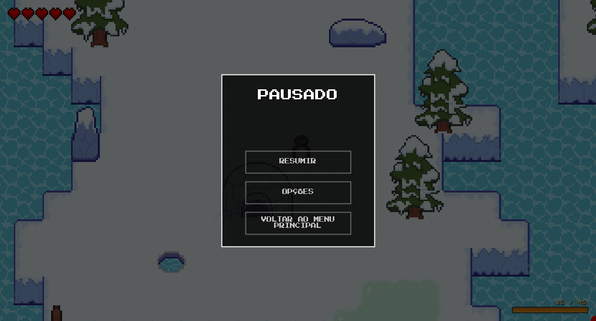

## Como executar

O jogo exige o Java JDK instalado no computador. Para executar o jogo, deve-se compilar o código fonte e executá-lo, com os comandos:

Compilação:
```bash
javac *.java
```

Execução:
```bash
java GameCore
```

Os arquivos de imagens, sons, mapas e demais recursos devem permanecer na pasta raiz do projeto.


## Autores

| Nome    | RA |
| ------- | -- |
| Alexander Enzo Açano | RA |
| André Arsky Silva Araujo | RA |
| Kauã Victor Menezes Ferraz | RA |
| Leonardo Lima Silva | RA |
